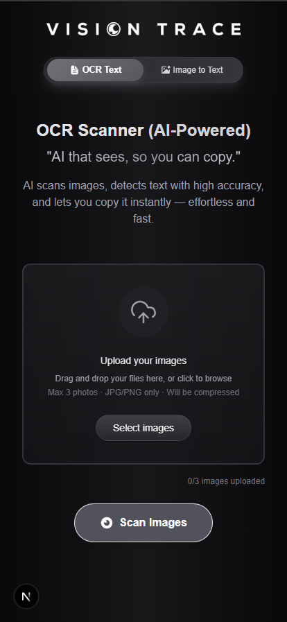
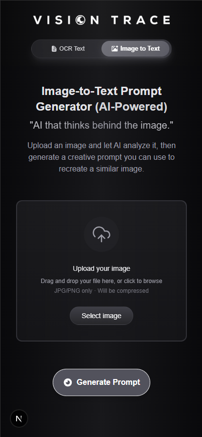
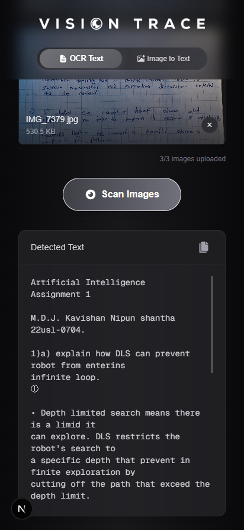
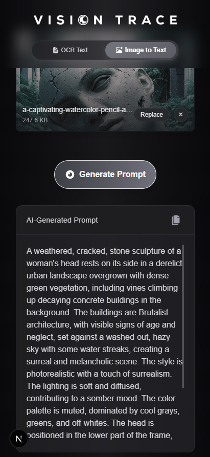

# VisionTrace

## 🌟 Demo
**Live App**: [https://visiontrace.vercel.app/](https://visiontrace.vercel.app/)  
**Repository**: [GitHub](https://github.com/kavishannip/VisionTrace-PWA.git)

VisionTrace is a Progressive Web App (PWA) that recognizes and extracts text from images and analyzes images to generate prompts for creating similar images, powered by Google Gemini.

## ✨ Features

- **Text Recognition**: Extract text from images using Google Gemini
- **AI Prompt Generation**: Convert images to descriptive prompts for AI image generation
- **Progressive Web App**: Can be installed on any device
- **Responsive Design**: Optimized for both mobile and desktop experiences

## 📱 Screenshots

   

## 💻 Tech Stack

- [Next.js](https://nextjs.org/)
- Progressive Web App (PWA) implementation
- Google Gemini API

## 🛠️ Getting Started

First, clone the repository:

```bash
git clone https://github.com/kavishannip/VisionTrace-PWA.git
cd VisionTrace-PWA
```

Install dependencies:

```bash
npm install
# or
yarn install
```

Run the development server:

```bash
npm run dev
# or
yarn dev
```

Open [http://localhost:3000](http://localhost:3000) with your browser to see the app in action.

## 📱 Installation as a PWA

VisionTrace can be installed on your device:
1. Open the website in a compatible browser
2. Look for the "Add to Home Screen" option
3. Enjoy VisionTrace as a standalone app!

## 👨‍💻 Developer

Designed and developed by Kavishan Nipun

[](https://www.linkedin.com/in/kavishan-nipun-876930222/)

